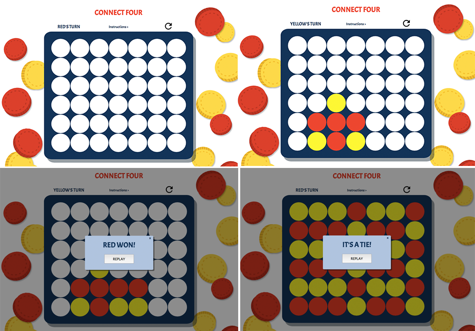

# Connect Four Game

## Description
 Connect Four is a two-player game in which the players take turns dropping one colored disc from the top into a seven-column, six-row vertically suspended grid. The pieces fall straight down, occupying the lowest available space within the column. The objective of the game is to be the first to form a horizontal, vertical, or diagonal line of four of one's own discs.

### Stages of the game
 

## Technologies Used
* HTML
* CSS
* Javascript

## Getting Started

https://judibo.github.io/connect-four/

## Pseudocode

* Set 2 players (colors) - variables
* Setting the board has an array (column)
* User can click on a circle
* When circle is clicked change to the Player's color
* If the column has empty circles below the one clicked, move circle to bottom (drop the piece to bottom)
* If column is filled - show message to try again
* After clicked, change the player's turn (color)

* Check for win/loss
    * if there are 4 circles of the same color(player) in any direction, there is a winner.
    * if all the circles on the board are filled, is a tie game.
    * process by column from left to right - check right/top/up-right (pic wall)

* Messages 
    * WINNER - display a modal box -"Player X won!"
    * TIE GAME - display a modal box "It's a tie game, play again?"
    *    circle is already clicked - show message "Try again." (modal?)

* Reset game
    * Clear the board
    *  Reset player
* Render game

